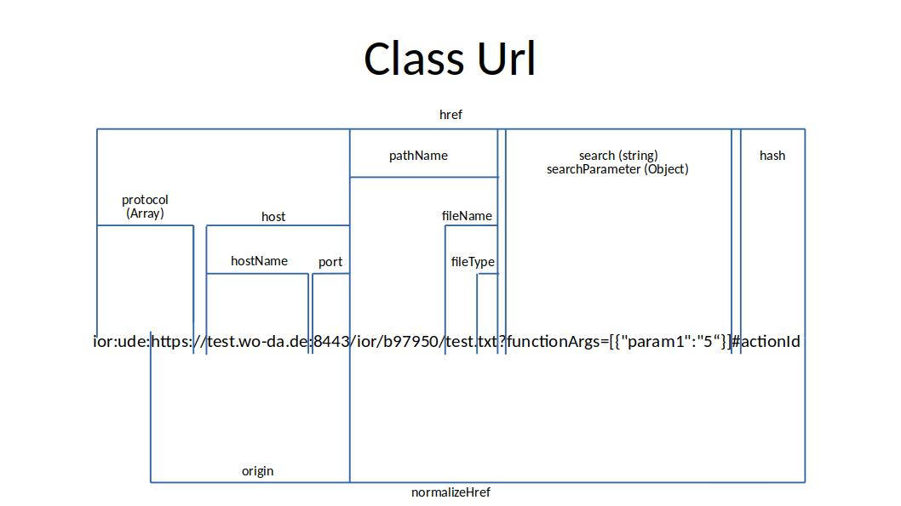

# What is it good for?
Url Object is used as a general object to hold a URL / Href 
The IOR is also a Url and have all functions from a Url

## Implementation

You can create an new Object with...
```javascript
Url.getInstance().init('some url')
or 
var url = Url.getInstance().init();
url.url = 'some url';
```

## Url Parameters


## Examples

### Parse url
```javascript
Url.getInstance().init('ior:ude:rest:http://localhost:8080/testdir/testfile.txt?test=foo#ActionDo=run')
    Url {_private: {…}, _protected: {…}, name: "Url", …}
        Store: (...)
        name: "Url"
        _private: {protocol: Array(4), hostName: "localhost", port: "8080", pathName: "/testdir/testfile.txt", search: "test=foo", …}
        _protected: {}
        fileName: "testfile.txt"
        fileType: "txt"
        hash: "ActionDo=run"
        host: "localhost:8080"
        hostName: "localhost"
        href: "ior:ude:rest:http://localhost:8080/testdir/testfile.txt?test=foo#ActionDo=run"
        id: (...)
        isIOR: (...)
        namespace: (...)
        normalizeHref: "http://localhost:8080/testdir/testfile.txt?test=foo#ActionDo=run"
        origin: "http://localhost:8080"
        package: (...)
        pathName: "/testdir/testfile.txt"
        port: "8080"
        protocol: Array(4)
            0: "ior"
            1: "ude"
            2: "rest"
            3: "http"
            hasProtocol: (p) => { return this._private.protocol.indexOf(p) !== -1; }
            length: 4
            __proto__: Array(0)
        search: "test=foo"
        type: (...)
        url: "ior:ude:rest:http://localhost:8080/testdir/testfile.txt?test=foo#ActionDo=run"
```
### Change Parameter directly in the urlObject
This is possible for all Parameter who are not joined together with different Parameter

```javascript
var urlObject = Url.getInstance().init('ior:ude:rest:http://localhost:8080/testdir/testfile.txt?test=foo#ActionDo=run')
urlObject.hostName = '127.0.0.1'
urlObject.href
=> "ior:ude:rest:http://127.0.0.1:8080/testdir/testfile.txt?test=foo#ActionDo=run"
```

### Check if the urlObject has a special Protocol
```javascript
var urlObject = Url.getInstance().init('ior:ude:rest:http://localhost:8080/testdir/testfile.txt?test=foo#ActionDo=run')
urlObject.protocol.hasProtocol('ior');
=> true
```
